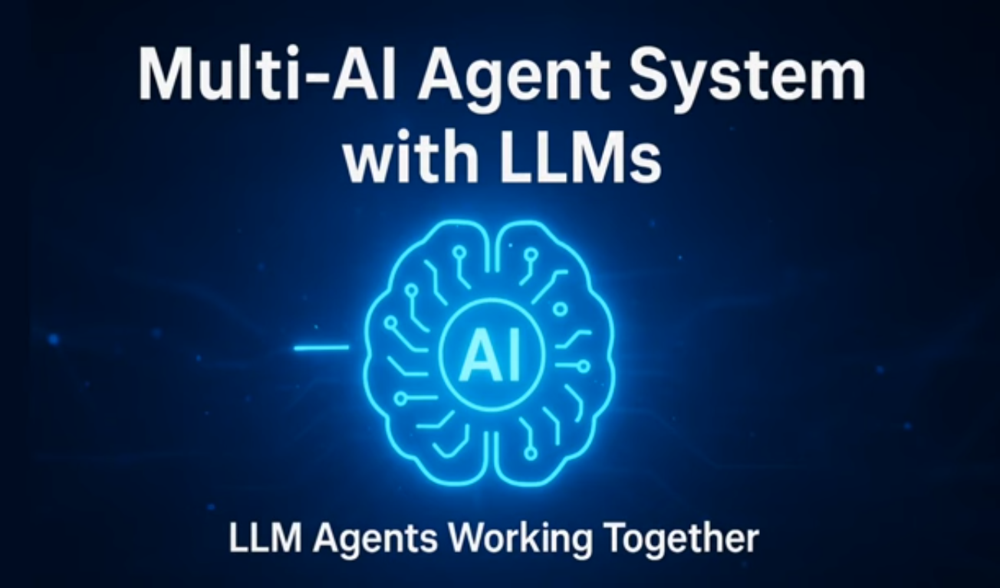
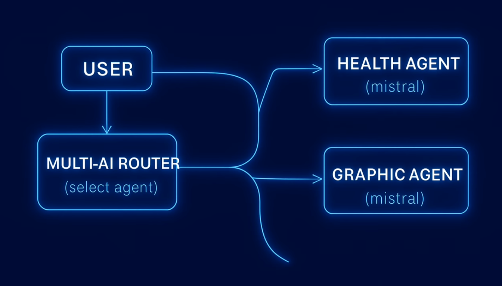
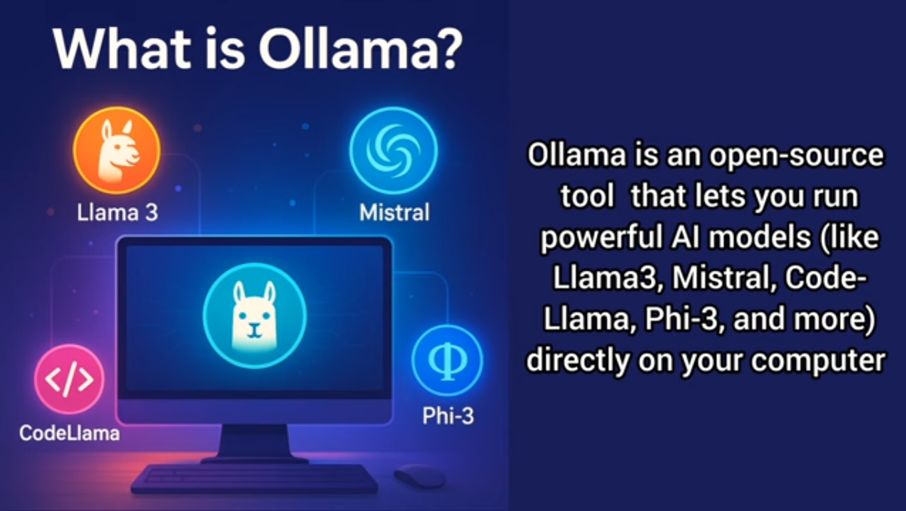

# Sistema de Agentes Multi-IA com LLMs Locais (Ollama + Node.js)

## Screenshots

## Architecture

## OLLAMA

Ollama é uma ferramenta de código aberto (open-source) que permite executar Large Language Models (LLMs), como Llama, Gemma, Mistral e outros, diretamente no seu computador pessoal (localmente).

